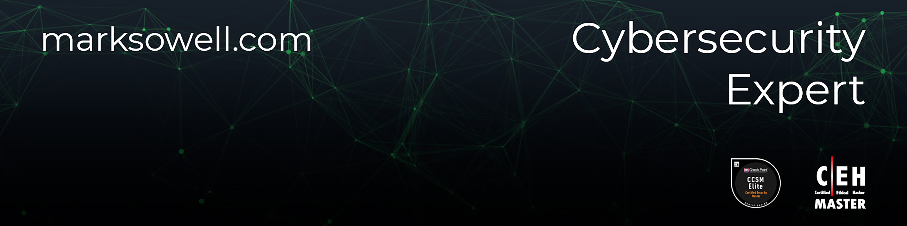
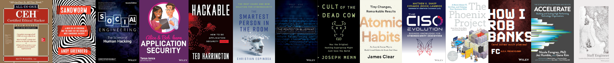

**Hi! I'm Mark **

I am an experienced penetration tester with a focus on application security in the following areas:

- Web applications  
- Mobile applications  
- Desktop applications  
- APIs, SDKs, and Web Services  
- Cloud applications  
- Microservices and containerized applications  
- Serverless applications  

Over the years, I have developed extensive experience in orchestrating comprehensive security assessments for a diverse range of applications and cultivated expertise in:

- **Strategic Leadership:** Defining methodologies, innovating toolsets, and setting best practices that steer effective and efficient penetration testing.
- **Consulting:** Serving as a principal application security consultant specializing in web, mobile (Android & iOS), automotive, desktop, and API testing.
- **Mentorship:** Empowering the next generation of security experts through training, guidance, and thought leadership.
- **Collaboration:** Bridging gaps between security teams, fostering a collaborative environment to collectively drive application resilience.
- **Remediation:** Identifying and developing remediation strategies for security findings and bug bounty reports, collaborating with development teams to ensure effective implementation.
- **Comprehensive Security Assessments:** Executing a wide range of penetration tests including external, internal, and application testing for global clients in various sectors, leading projects from scoping to detailed reporting and remediation.

I am passionate about strengthening the security posture of applications, constantly evolving my techniques to stay ahead of emerging threats, and ensuring the highest standards of application security.

Here are some stats about the languages I use in my repositories:  
  

## Connect with me

[<picture><source media="(prefers-color-scheme: dark)" srcset="images/website_white.svg"><source media="(prefers-color-scheme: light)" srcset="images/website.svg"></picture>][website]&nbsp;&nbsp;&nbsp;
[<picture><source media="(prefers-color-scheme: dark)" srcset="images/linkedin_white.svg"><source media="(prefers-color-scheme: light)" srcset="images/linkedin.svg"></picture>][linkedin]&nbsp;&nbsp;&nbsp;
[<picture><source media="(prefers-color-scheme: dark)" srcset="images/x_white.svg"><source media="(prefers-color-scheme: light)" srcset="images/x.svg"></picture>][twitter]&nbsp;&nbsp;&nbsp;
[<picture><source media="(prefers-color-scheme: dark)" srcset="images/github_white.svg"><source media="(prefers-color-scheme: light)" srcset="images/github.svg"></picture>][github]&nbsp;&nbsp;&nbsp;
[<picture><source media="(prefers-color-scheme: dark)" srcset="images/slack_white.svg"><source media="(prefers-color-scheme: light)" srcset="images/slack.svg"></picture>][slack]&nbsp;&nbsp;&nbsp;
[<picture><source media="(prefers-color-scheme: dark)" srcset="images/discord_white.svg"><source media="(prefers-color-scheme: light)" srcset="images/discord.svg"></picture>][discord]&nbsp;&nbsp;&nbsp;
[<picture><source media="(prefers-color-scheme: dark)" srcset="images/youtube_white.svg"><source media="(prefers-color-scheme: light)" srcset="images/youtube.svg"></picture>][youtube]&nbsp;&nbsp;&nbsp;
[<picture><source media="(prefers-color-scheme: dark)" srcset="images/telegram_white.svg"><source media="(prefers-color-scheme: light)" srcset="images/telegram.svg"></picture>][telegram]&nbsp;&nbsp;&nbsp;
[<picture><source media="(prefers-color-scheme: dark)" srcset="images/medium_white.svg"><source media="(prefers-color-scheme: light)" srcset="images/medium.svg"></picture>][medium]

## Research platforms

[<picture><source media="(prefers-color-scheme: dark)" srcset="images/tryhackme_white.svg"><source media="(prefers-color-scheme: light)" srcset="images/tryhackme.svg"></picture>][tryhackme]&nbsp;&nbsp;&nbsp;
[<picture><source media="(prefers-color-scheme: dark)" srcset="images/hackthebox_white.svg"><source media="(prefers-color-scheme: light)" srcset="images/hackthebox.svg"></picture>][hackthebox]&nbsp;&nbsp;&nbsp;
[<picture><source media="(prefers-color-scheme: dark)" srcset="images/hackerone_white.svg"><source media="(prefers-color-scheme: light)" srcset="images/hackerone.svg"></picture>][hackerone]&nbsp;&nbsp;&nbsp;
[<picture><source media="(prefers-color-scheme: dark)" srcset="images/bugcrowd_white.svg"><source media="(prefers-color-scheme: light)" srcset="images/bugcrowd.svg"></picture>][bugcrowd]&nbsp;&nbsp;&nbsp;

## Certifications

[<picture><source media="(prefers-color-scheme: dark)" srcset="images/accredible_white.webp"><source media="(prefers-color-scheme: light)" srcset="images/accredible.webp"></picture>][accredible]&nbsp;&nbsp;&nbsp;
[<picture><source media="(prefers-color-scheme: dark)" srcset="images/credly2.svg"><source media="(prefers-color-scheme: light)" srcset="images/credly2.svg"></picture>][Credly]&nbsp;&nbsp;&nbsp;
[<picture><source media="(prefers-color-scheme: dark)" srcset="images/ec-council.svg"><source media="(prefers-color-scheme: light)" srcset="images/ec-council.svg"></picture>][eccouncil]&nbsp;&nbsp;&nbsp;

## Bookshelf

[<picture><source media="(prefers-color-scheme: dark)" srcset="images/Goodreads_logo_white.svg"><source media="(prefers-color-scheme: light)" srcset="images/Goodreads_logo.svg"></picture>][GoodReads]

[][GoodReads]

[website]: https://marksowell.com
[github]: https://github.com/marksowell  
[youtube]: https://www.youtube.com/c/MarkSowell-Denver/playlists
[linkedin]: https://www.linkedin.com/in/marksowell/
[hackthebox]: https://app.hackthebox.com/profile/319820
[bugcrowd]: https://bugcrowd.com/marksowell
[hackerone]: https://hackerone.com/marksowell
[tryhackme]: https://tryhackme.com/p/marksowell  
[twitter]: https://twitter.com/marksowell/  
[telegram]: https://t.me/marksowell
[credly]: https://www.credly.com/users/marksowell/badges?sort=-state_updated_at
[eccouncil]: https://aspen.eccouncil.org/VerifyBadge?type=certification&a=hrh5u5BN7tpBPrNa4iembfeuOXjVqqECsmvVrUh2oeI=  
[goodreads]: https://www.goodreads.com/marksowell
[medium]: https://medium.com/@mark-sowell
[slack]: https://join.slack.com/t/marksowell/shared_invite/zt-2nvfws8ow-r53YEMmfquAIKr4QubeB~g
[discord]: https://discord.gg/mqPDCRWXMa
[accredible]: https://www.credential.net/profile/mark-sowell/wallet
