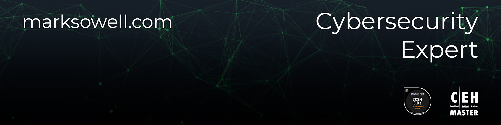

<a href="https://github.com/marksowell">
<a href="https://keybase.io/marksowell">
<a href="https://stats.uptimerobot.com/60WvLSoxxz/786870760">
<a href="https://marksowell.com">

### Hi there! I'm Mark Sowell 

### 🔗 Connect with me

[][website]
[][linkedin]
[][twitter]
[][github]
[][youtube]
[][telegram]

 
  
### 
 Research platforms

  
[][tryhackme]
[][hackthebox]
[][hackerone]
[][bugcrowd]
  
 
  
### 🏆 Certifications  
  
Credly: https://www.credly.com/users/marksowell/badges?sort=-state_updated_at  
EC-Council: https://aspen.eccouncil.org/VerifyBadge?type=certification&a=hrh5u5BN7tpBPrNa4iembfeuOXjVqqECsmvVrUh2oeI=  

[website]: https://marksowell.com
[github]: https://github.com/marksowell  
[youtube]: https://www.youtube.com/channel/UCuHMYk-np8zBOkGtlkN5PrA
[linkedin]: https://www.linkedin.com/in/marksowell/
[hackthebox]: https://app.hackthebox.com/profile/319820
[bugcrowd]: https://bugcrowd.com/marksowell
[hackerone]: https://hackerone.com/marksowell
[tryhackme]: https://tryhackme.com/p/marksowell  
[twitter]: https://twitter.com/marksowell/  
[telegram]: https://t.me/marksowell
