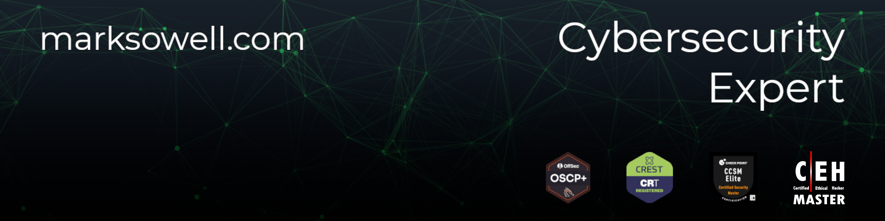
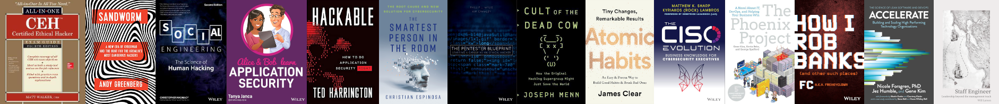

**Hi! I'm Mark **

I am an experienced penetration tester and application security leader specializing in offensive security, security consulting, presales, and application security strategy across the following areas:

- Web applications  
- Mobile applications (Android & iOS)  
- Desktop applications  
- APIs, SDKs, and Web Services  
- Cloud and SaaS platforms  
- Microservices and containerized applications  
- Serverless and distributed applications  
- AI-enabled platforms, integrations, and emerging technologies

Over the years, I have led application security initiatives, offensive security programs, and large-scale security assessments to strengthen security posture and reduce organizational risk.

Experience:

- **Strategic Leadership:** Defining methodologies, creating tooling and workflows, and establishing best practices across offensive security and application security programs.
- **Security Consulting & Advisory:** Principal-level application security leader and trusted advisor across web, mobile, cloud, API, AI, and enterprise security initiatives.
- **Presales & Customer Engagement:** Supporting engagements from discovery and scoping through technical strategy, executive communication, delivery, and long-term customer success.
- **Team Leadership & Mentorship:** Leading and mentoring penetration testers and security consultants through hiring, onboarding, escalations, technical enablement, and quality assurance across distributed teams.
- **Application & Platform Security:** Assessing APIs, OAuth integrations, SaaS platforms, cloud-native applications, AI-enabled workflows, and distributed architectures.
- **AI & Emerging Technologies:** Evaluating AI-enabled applications and integrations while helping organizations understand emerging attack surfaces and security risks.
- **Comprehensive Security Assessments:** Leading external, internal, application, cloud, red team, and physical security assessments including attack path analysis, remediation guidance, and executive reporting.
- **Cross-Functional Collaboration:** Partnering with engineering, product, architecture, operations, and security teams to improve remediation efforts and secure development practices across complex environments.

I focus on combining deep technical expertise with leadership to help organizations build scalable and effective security programs.

Here are some stats about the languages I use in my repositories:  
  

## Connect with me

[<picture><source media="(prefers-color-scheme: dark)" srcset="images/website_white.svg"><source media="(prefers-color-scheme: light)" srcset="images/website.svg"></picture>][website]&nbsp;&nbsp;&nbsp;
[<picture><source media="(prefers-color-scheme: dark)" srcset="images/linkedin_white.svg"><source media="(prefers-color-scheme: light)" srcset="images/linkedin.svg"></picture>][linkedin]&nbsp;&nbsp;&nbsp;
[<picture><source media="(prefers-color-scheme: dark)" srcset="images/x_white.svg"><source media="(prefers-color-scheme: light)" srcset="images/x.svg"></picture>][twitter]&nbsp;&nbsp;&nbsp;
[<picture><source media="(prefers-color-scheme: dark)" srcset="images/github_white.svg"><source media="(prefers-color-scheme: light)" srcset="images/github.svg"></picture>][github]&nbsp;&nbsp;&nbsp;
[<picture><source media="(prefers-color-scheme: dark)" srcset="images/slack_white.svg"><source media="(prefers-color-scheme: light)" srcset="images/slack.svg"></picture>][slack]&nbsp;&nbsp;&nbsp;
[<picture><source media="(prefers-color-scheme: dark)" srcset="images/discord_white.svg"><source media="(prefers-color-scheme: light)" srcset="images/discord.svg"></picture>][discord]&nbsp;&nbsp;&nbsp;
[<picture><source media="(prefers-color-scheme: dark)" srcset="images/youtube_white.svg"><source media="(prefers-color-scheme: light)" srcset="images/youtube.svg"></picture>][youtube]&nbsp;&nbsp;&nbsp;
[<picture><source media="(prefers-color-scheme: dark)" srcset="images/telegram_white.svg"><source media="(prefers-color-scheme: light)" srcset="images/telegram.svg"></picture>][telegram]&nbsp;&nbsp;&nbsp;
[<picture><source media="(prefers-color-scheme: dark)" srcset="images/medium_white.svg"><source media="(prefers-color-scheme: light)" srcset="images/medium.svg"></picture>][medium]

## Research platforms

[<picture><source media="(prefers-color-scheme: dark)" srcset="images/tryhackme_white.svg"><source media="(prefers-color-scheme: light)" srcset="images/tryhackme.svg"></picture>][tryhackme]&nbsp;&nbsp;&nbsp;
[<picture><source media="(prefers-color-scheme: dark)" srcset="images/hackthebox_white.svg"><source media="(prefers-color-scheme: light)" srcset="images/hackthebox.svg"></picture>][hackthebox]&nbsp;&nbsp;&nbsp;
[<picture><source media="(prefers-color-scheme: dark)" srcset="images/hackerone_white.svg"><source media="(prefers-color-scheme: light)" srcset="images/hackerone.svg"></picture>][hackerone]&nbsp;&nbsp;&nbsp;
[<picture><source media="(prefers-color-scheme: dark)" srcset="images/bugcrowd_white.svg"><source media="(prefers-color-scheme: light)" srcset="images/bugcrowd.svg"></picture>][bugcrowd]&nbsp;&nbsp;&nbsp;

## Certifications

[<picture><source media="(prefers-color-scheme: dark)" srcset="images/accredible_white.webp"><source media="(prefers-color-scheme: light)" srcset="images/accredible.webp"></picture>][accredible]&nbsp;&nbsp;&nbsp;
[<picture><source media="(prefers-color-scheme: dark)" srcset="images/credly2.svg"><source media="(prefers-color-scheme: light)" srcset="images/credly2.svg"></picture>][Credly]&nbsp;&nbsp;&nbsp;
[<picture><source media="(prefers-color-scheme: dark)" srcset="images/ec-council.svg"><source media="(prefers-color-scheme: light)" srcset="images/ec-council.svg"></picture>][eccouncil]&nbsp;&nbsp;&nbsp;

## Bookshelf

[<picture><source media="(prefers-color-scheme: dark)" srcset="images/Goodreads_logo_white.svg"><source media="(prefers-color-scheme: light)" srcset="images/Goodreads_logo.svg"></picture>][GoodReads]

[][GoodReads]

[website]: https://marksowell.com
[github]: https://github.com/marksowell  
[youtube]: https://www.youtube.com/c/MarkSowell-Denver/playlists
[linkedin]: https://www.linkedin.com/in/marksowell/
[hackthebox]: https://app.hackthebox.com/profile/319820
[bugcrowd]: https://bugcrowd.com/h/marksowell
[hackerone]: https://hackerone.com/marksowell
[tryhackme]: https://tryhackme.com/p/marksowell  
[twitter]: https://twitter.com/marksowell/  
[telegram]: https://t.me/marksowell
[credly]: https://www.credly.com/users/marksowell/badges?sort=-state_updated_at
[eccouncil]: https://aspen.eccouncil.org/VerifyBadge?type=certification&a=hrh5u5BN7tpBPrNa4iembfeuOXjVqqECsmvVrUh2oeI=  
[goodreads]: https://www.goodreads.com/marksowell
[medium]: https://medium.com/@mark-sowell
[slack]: https://join.slack.com/t/marksowell/shared_invite/zt-2nvfws8ow-r53YEMmfquAIKr4QubeB~g
[discord]: https://discord.gg/mqPDCRWXMa
[accredible]: https://www.credential.net/profile/mark-sowell/wallet
